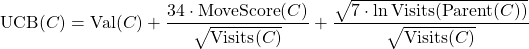

# CodeCup2022

5th place AI for the [2022 CodeCup challenge](https://www.codecup.nl/competition.php?comp=280), playing the game of [Spaghetti](https://www.codecup.nl/spaghetti/rules.php).

## Strategy

Amatriciana is a fairly standard [UCT Monte Carlo](https://en.wikipedia.org/wiki/Monte_Carlo_tree_search) player.

Rollouts are completely random and the player only cares about its own score, completely disregarding the opponent's. The only tweaks are in how tree nodes select their child (the next move to examine). First, each child move is tried once. Then, the first 1000 visits to a node, it selects a random child. Only after that does it use UCB to select the most promising child. The UCB formula has one additional term, and some tweaked constants:

The second term steers exploration towards moves that score points right away, and away from moves that lose points. 

## Path tracking

Efficiently keeping track of the score was important for this challenge, especially because I also wanted to be able to undo moves in constant time. Since paths are the key to everything, and paths start and end at the midpoint of a grid edge, I decided to track those, instead of grid cells. I kept track of two properties for each midpoint: the midpoint at the other end of the path starting at this midpoint, and the length of that path. This means connecting two paths only requires me to update the information at either end.

What's more, if we don't change the old endpoints, they have enough information to undo the move just as quickly. And the lengths can be used to quickly find the score if the new endpoints are on either side of the board. Cycle detection is also easy. The only downside is that it requires the two path segments on a tile to be inserted one by one, and there are situations where the order in which they are inserted affects the score (if the move creates a path that passes through the tile twice). I sacrificed a little accuracy for performance by not implementing that case properly.

## Navigating the code

The final submission is [Amatriciana](src/Amatriciana.java), but it is not very readable. As the CodeCup has a file size limit, I minify the submissions (using [SubmissionPackager](src/codecup2022/tools/SubmissionPackager.java)) so I don't have to worry about whitespace and comments during development.

The entrypoint for the bot is [PlayerRunner](src/codecup2022/runner/PlayerRunner.java), which creates and starts the player. For the final competition, that was a [LimitedValueUCTPlayer](src/codecup2022/player/LimitedValueUCTPlayer.java). This last class contains the Monte Carlo Tree search logic.

The important data structures are in the `data` package, and include [Move](src/codecup2022/data/Move.java), [Paths](src/codecup2022/data/Paths.java), and the various implementations of the [Board](src/codecup2022/data/Board.java) class.

The `movegenerator` package contains various classes that generate interesting moves from given a board position, although my final submission only uses the [AllMoves](src/codecup2022/movegenerator/AllMoves.java) generator. The `player` package contains many different players, which were either building blocks, experiments, or opponents in local test competitions. The local test competitions were run with the classes in the `runner` and `tools` packages. Finally, the `stopcriterion` package contains two simple ways of deciding when a player should stop looking for a better move.
